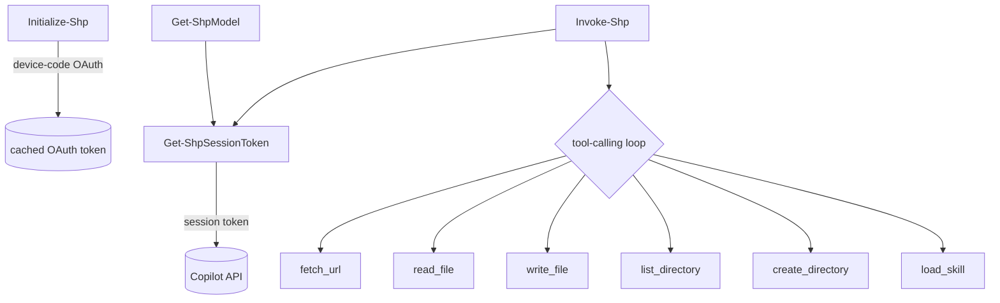

# System patterns

Architecture and recurring implementation patterns for ShellPilot. Update this
file when a new pattern is adopted or an old one is retired.

## Current architecture

A single script module (ShellPilot/ShellPilot.psm1) with a manifest (ShellPilot/ShellPilot.psd1) and
a data file (ShellPilot/PriceTable.psd1).

## Public surface

- Initialize-Shp - device-code OAuth, caches the token.
- Get-ShpModel - lists models per endpoint.
- Get-ShpModelName - cached model ids for tab-completion.
- Invoke-Shp - one prompt, optional tool-calling loop, rich object result.

## Private helpers

Get-ShpSessionToken, Invoke-CopilotTurn, the tool back-ends
(Invoke-FetchUrlTool, Invoke-ReadFileTool, Invoke-ListDirectoryTool,
Invoke-WriteFileTool, New-DirectoryTool), and the customisation loaders
(Get-ShpInstructionContent, Get-ShpSkillCatalog).

## Recurring patterns

### Dual API abstraction

Invoke-CopilotTurn hides the difference between the chat/completions and
responses API shapes behind one normalised result object (content, tool
calls, usage, reasoning, raw). Invoke-Shp starts on chat and falls back to
responses (or the reverse for reasoning) based on error signatures.

### Tool-calling loop

Each tool is declared as a JSON schema, dispatched by name in a switch, and
its result handed back to the model. A MaxToolIterations guard plus a
consecutive-empty-tool-call circuit breaker prevent runaway loops.

### Progressive disclosure for skills

Get-ShpSkillCatalog injects only skill names and descriptions; the model
pulls a full SKILL.md body on demand through the load_skill tool - mirroring
how VS Code selects skills.

### Front-matter stripping

Get-ShpInstructionContent removes the leading YAML front-matter block so the
same instruction, agent, and skill files used by VS Code can feed the system
prompt.

### Cost from a data file

PriceTable.psd1 maps a model id to per-token rates; cost and credit figures
are computed from reported usage, with the price key resolved
case-insensitively.

### Tab-completion

Register-ArgumentCompleter on Invoke-Shp -Model, backed by a module-scoped
cache that falls back to the price table offline.

## Patterns to introduce (pending decisions)

- Split the monolithic .psm1 into a one-function-per-file source layout.
- Pester 5 unit tests with mocked HTTP.
- Structured error records instead of throwing strings.
- Optional secret-store backing for the token.
