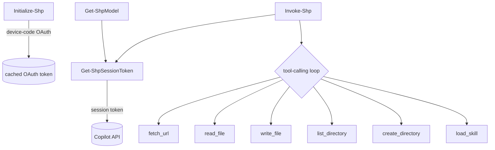

# System patterns

Architecture and recurring implementation patterns for ShellPilot. Update this
file when a new pattern is adopted or an old one is retired.

## Current architecture

A Sampler-built script module. Source lives under source/ (one function per
file) and is compiled by ModuleBuilder into a single versioned module under
output/ at build time.

```text
source/
  Public/    Initialize-Shp, Get-ShpModel, Get-ShpModelName, Invoke-Shp
  Private/   9 helper functions (session token, tool back-ends, loaders)
  Prefix.ps1 module-scope $script: defaults + price-table load
  Suffix.ps1 Register-ArgumentCompleter for Invoke-Shp -Model
  PriceTable.psd1 (copied into the built module via CopyPaths)
  ShellPilot.psd1 / ShellPilot.psm1 (empty; ModuleBuilder fills it)
```

ModuleBuilder concatenates Prefix + Private + Public + Suffix into the built
.psm1; the runtime call graph is unchanged:



## Public surface

- Initialize-Shp - device-code OAuth, caches the token.
- Get-ShpModel - lists models per endpoint, with capability limits.
- Get-ShpModelName - cached model ids for tab-completion.
- Select-ShpModel - sets the session default model, effort, and output cap.
- Get-ShpDefault - reads the current session defaults.
- Get-ShpChat - reads the running session conversation.
- Clear-ShpChat - resets the running session conversation.
- Get-ShpUsage - reads the per-session usage log (or -Summary aggregate).
- Clear-ShpUsage - resets the per-session usage log.
- Invoke-Shp - one prompt, optional tool-calling loop, rich object result.
- Set-ShpContext / Get-ShpContext / Clear-ShpContext - session connection
  options (timeout, retry, opt-in alternative backend).
- Register-ShpTool / Get-ShpTool / Unregister-ShpTool - expose any command to
  the model as a user-defined tool.
- ConvertTo-ShpTokenCount / Get-ShpCostEstimate - estimate prompt size and cost
  before sending.
- Request-ShpEmbedding / Get-ShpCosineSimilarity - embeddings and similarity.
- Start-ShpChat - interactive console chat session (REPL).

## Private helpers

Get-ShpSessionToken, Invoke-CopilotTurn, the streaming helpers
(Invoke-ShpStreamRequest, Read-ShpChatStream), the tool back-ends
(Invoke-FetchUrlTool, Invoke-ReadFileTool, Invoke-ListDirectoryTool,
Invoke-WriteFileTool, New-DirectoryTool, Invoke-RunCommandTool [run_command],
Read-ShpUserInput [ask_user]), the customisation loaders
(Get-ShpInstructionContent, Get-ShpSkillCatalog, Get-ShpInstructionCatalog),
the retry wrapper (Invoke-ShpWithRetry), the shared connection-pooling HTTP
client accessor (Get-ShpHttpClient) and its buffered non-streaming sender
(Invoke-ShpHttpRequest), the user-tool schema builder
(New-ShpToolSchema), and the vision content builder (ConvertTo-ShpImageContent).

## Recurring patterns

### Dual API abstraction

Invoke-CopilotTurn hides the difference between the chat/completions and
responses API shapes behind one normalised result object (content, tool
calls, usage, reasoning, raw). Invoke-Shp starts on chat and falls back to
responses (or the reverse for reasoning) based on error signatures.

Per-shape request fields are mapped in one place: reasoning effort is
reasoning_effort (chat) vs reasoning.effort (responses), and the output cap is
max_tokens (chat) vs max_output_tokens (responses). The service validates the
effort value per model and returns a clear error for unsupported values.

### Tool-calling loop

Each tool is declared as a JSON schema, dispatched by name in a switch, and
its result handed back to the model. A MaxToolIterations guard plus a
consecutive-empty-tool-call circuit breaker prevent runaway loops. Tool
categories are on by default and each has an opt-out switch: fetch_url
(-DisableBrowsing), the file tools (-DisableFileAccess), run_command
(-DisableTerminal), and ask_user (-DisableUserPrompts). run_command runs in a
child PowerShell with full, unsandboxed privileges; ask_user blocks on Read-Host
and degrades gracefully (a "no console" envelope) when non-interactive. Both
run_command and ask_user surface what happened on the result (CommandsRun,
QuestionsAsked). load_instruction mirrors load_skill for -InstructionRoot.

### Progressive disclosure for skills

Get-ShpSkillCatalog injects only skill names and descriptions; the model
pulls a full SKILL.md body on demand through the load_skill tool - mirroring
how VS Code selects skills.

### Reasoning trace streaming

The model's chain-of-thought is delivered as reasoning_text deltas on the
streaming /chat/completions response (the field VS Code reads); other providers
use reasoning_content or a reasoning string. Read-ShpChatStream collects all
three (ignoring the encrypted reasoning_opaque signature blob), and Invoke-Shp
-ShowThinking echoes them live in dim italic under a 'thinking:' label, falling
back to the /responses reasoning summary only when streaming is disabled.

### Front-matter stripping

Get-ShpInstructionContent removes the leading YAML front-matter block so the
same instruction, agent, and skill files used by VS Code can feed the system
prompt.

### Cost from a data file

PriceTable.psd1 maps a model id to per-token rates; cost and credit figures
are computed from reported usage, with the price key resolved
case-insensitively.

### HTTP retry and connection options

Every non-streaming HTTP call (chat, responses, /models, the token exchange,
and embeddings) is wrapped by the private Invoke-ShpWithRetry, which retries a
transient 429/5xx with exponential backoff. The request options are passed to
the wrapper via -ArgumentList and consumed by a param() script block - NOT via
.GetNewClosure(), because a closure makes Pester mocks of Invoke-WebRequest /
Invoke-RestMethod miss and the call hits the network. Connection options
(timeout, retry count and delay, and an opt-in ApiBase/ApiKey alternative
backend) resolve with the same precedence as the model defaults: explicit
parameter > session context (Set-ShpContext, $script:ShpContext) > built-in
default.

### Connection and session-token reuse (per-Turn latency)

A Turn is a loop - one API round-trip per tool iteration - so "do the expensive
network setup once, then reuse" mirrors what the VS Code Copilot extension gets
for free. Two module-scoped caches implement this without touching any public
API, result object, or the streaming/tool-loop behaviour:

- Session-token cache ($script:ShpSessionTokenCache): Get-ShpSessionToken caches
  the token-exchange response keyed by a SHA-256 hash of the OAuth token plus the
  Editor-Version, and returns it while more than a 60s safety margin
  ($script:SessionTokenSafetyMarginSec) remains before its expires_at. -Force
  bypasses the cache; Initialize-Shp clears it on re-auth. A partial/expired entry
  is refetched.
- Shared HttpClient ($script:ShpHttpClient, built lazily by Get-ShpHttpClient):
  one connection-pooling client on a SocketsHttpHandler (2-min
  PooledConnectionLifetime, HTTP/2 preferred) is reused for every request, so the
  loop pays one TCP + TLS handshake instead of one per iteration. Per-request
  Authorization/editor headers go on the HttpRequestMessage, never the shared
  client; its Timeout stays InfiniteTimeSpan (streaming needs it) and the
  non-streaming sender (Invoke-ShpHttpRequest) bounds itself with a
  CancellationTokenSource. The shared client is never disposed per request;
  Invoke-ShpStreamRequest disposes only the response and reader. Non-success
  throws HttpResponseException so the Invoke-ShpWithRetry classification is
  unchanged.

### User-defined tools

Register-ShpTool turns any command into a tool: New-ShpToolSchema derives a
JSON schema from the command's parameter metadata (types, ValidateSet -> enum,
mandatory -> required, common parameters skipped). The schema is stored in
$script:ShpUserTools; Invoke-Shp adds the registered schemas to its tool list
and the tool-loop default case dispatches a call by invoking the backing
command with the model-supplied arguments.

### Session state (defaults, conversation, usage)

Three module-scoped variables hold per-session state, all set/reset through
cmdlets and never persisted to disk. The third:

- $script:ShpUsageLog (a List[pscustomobject]) - Invoke-Shp appends one record
  per call (timestamp, model, prompt, token counts, cached, cost, credits,
  iterations, tool-call count, finish reason, duration), including stateless
  -History calls. Read by Get-ShpUsage (records, or a totals + per-model
  breakdown with -Summary), reset by Clear-ShpUsage.

The other two:

- $script:ShpDefaults (model, reasoning effort, max output tokens) - written by
  Select-ShpModel, read by Get-ShpDefault. Invoke-Shp resolves each value:
  explicit parameter wins, then the session default, then the built-in model
  fallback (claude-opus-4.7).
- $script:ShpChat (the most recent user/assistant turns) - read by Get-ShpChat,
  reset by Clear-ShpChat. Invoke-Shp records every call's constituted
  conversation here (seed + this exchange), EXCEPT explicit -History calls which
  stay stateless. Continuation is the default: every call seeds from
  $script:ShpChat (empty on the first call, populated afterwards), so a
  follow-up prompt remembers earlier turns without any switch. To start fresh,
  run Clear-ShpChat. -History bypasses the session entirely (handy for
  scriptable, stateless multi-turn flows). Every result carries the updated
  History. The system prompt is rebuilt each call (it depends on the per-call
  tool and instruction flags) and is never stored in the history.

### Build pipeline (Sampler)

build.ps1 bootstraps dependencies into output/RequiredModules, then InvokeBuild
runs the workflow from build.yaml: Clean, Build_Module_ModuleBuilder,
Create_changelog_release_output, then Pester. GitVersion derives the module
version from commits and branch (ai/* branches produce a -ai prerelease tag).

## Patterns adopted

- One-function-per-file source layout under source/ (done).
- Sampler build with ModuleBuilder, Pester 5, GitVersion (done).

## Patterns to introduce (pending)

- Raise code coverage further (currently ~74%; the CodeCoverageThreshold in
  build.yaml is a 20% floor) by testing the large, network-bound public
  functions (Invoke-Shp, Initialize-Shp), then lift the threshold.
- Structured error records instead of throwing strings.
- Optional secret-store backing for the token (encrypted storage decision).
