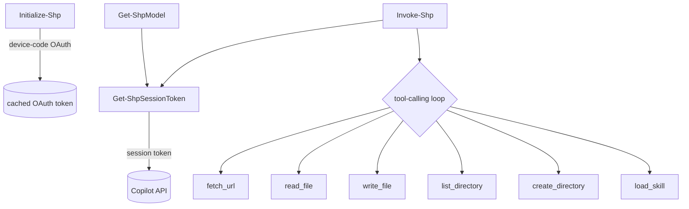

# System patterns

Architecture and recurring implementation patterns for ShellPilot. Update this
file when a new pattern is adopted or an old one is retired.

## Current architecture

A Sampler-built script module. Source lives under source/ (one function per
file) and is compiled by ModuleBuilder into a single versioned module under
output/ at build time.

```text
source/
  Public/    Initialize-Shp, Get-ShpModel, Get-ShpModelName, Invoke-Shp
  Private/   9 helper functions (session token, tool back-ends, loaders)
  Prefix.ps1 module-scope $script: defaults + price-table load
  Suffix.ps1 Register-ArgumentCompleter for Invoke-Shp -Model
  data/PriceTable.psd1 (copied into the built module via CopyPaths)
  ShellPilot.psd1 / ShellPilot.psm1 (empty; ModuleBuilder fills it)
```

ModuleBuilder concatenates Prefix + Private + Public + Suffix into the built
.psm1; the runtime call graph is unchanged:



## Public surface

- Initialize-Shp - device-code OAuth, caches the token.
- Get-ShpModel - lists models per endpoint, with capability limits.
- Get-ShpModelName - cached model ids for tab-completion.
- Select-ShpModel - sets the session default model, effort, and output cap.
- Get-ShpDefault - reads the current session defaults.
- Get-ShpChat - reads the running session conversation.
- Clear-ShpChat - resets the running session conversation.
- Get-ShpUsage - reads the per-session usage log (or -Summary aggregate).
- Clear-ShpUsage - resets the per-session usage log.
- Invoke-Shp - one prompt, optional tool-calling loop, rich object result.
- Invoke-ShpBatch - many independent prompts, run concurrently under a
  -ThrottleLimit, one ShellPilot.BatchResult per input; stateless per item and
  failure-isolated by contract.
- Set-ShpContext / Get-ShpContext / Clear-ShpContext - session connection
  options (timeout, retry, opt-in alternative backend).
- Register-ShpTool / Get-ShpTool / Unregister-ShpTool - expose any command to
  the model as a user-defined tool.
- ConvertTo-ShpTokenCount / Get-ShpCostEstimate - estimate prompt size and cost
  before sending.
- Request-ShpEmbedding / Get-ShpCosineSimilarity - embeddings and similarity.
- Start-ShpChat - interactive console chat session (REPL).

## Private helpers

Get-ShpSessionToken, Invoke-CopilotTurn, the streaming helpers
(Invoke-ShpStreamRequest, Read-ShpChatStream), the tool back-ends
(Invoke-FetchUrlTool, Invoke-ReadFileTool, Invoke-ListDirectoryTool,
Invoke-WriteFileTool, New-DirectoryTool, Invoke-RunCommandTool [run_command],
Read-ShpUserInput [ask_user]), the customisation loaders
(Get-ShpInstructionContent, Get-ShpSkillCatalog, Get-ShpInstructionCatalog),
the retry wrapper (Invoke-ShpWithRetry), the shared connection-pooling HTTP
client accessor (Get-ShpHttpClient) and its buffered non-streaming sender
(Invoke-ShpHttpRequest), the user-tool schema builder
(New-ShpToolSchema), the context-window guard (Compress-ShpChatContext), and the
vision content builder (ConvertTo-ShpImageContent).

## Recurring patterns

### Dual API abstraction

Invoke-CopilotTurn hides the difference between the chat/completions and
responses API shapes behind one normalised result object (content, tool
calls, usage, reasoning, raw). Invoke-Shp starts on chat and falls back to
responses (or the reverse for reasoning) based on error signatures.

Per-shape request fields are mapped in one place: reasoning effort is
reasoning_effort (chat) vs reasoning.effort (responses), and the output cap is
max_tokens (chat) vs max_output_tokens (responses). The service validates the
effort value per model and returns a clear error for unsupported values.

### Omit-or-send for optional request fields

An optional field must be ABSENT from the request body when the caller did not
ask for it, so the backend default applies and existing calls stay
byte-identical. Two idioms exist and picking the wrong one is a silent bug:

- Sentinel (`-gt 0`, `IsNullOrWhiteSpace`) works only where the type's default
  is meaningless - `MaxOutputTokens`, `ReasoningEffort`.
- Binding (`$PSBoundParameters.ContainsKey(...)`) is required wherever the
  type's default is a legitimate value. Temperature and TopP are the case in
  point: `0` is a real setting, so a sentinel would silently treat
  `-Temperature 0` - the whole reason the parameter exists - as "not supplied".

Invoke-Shp collects bound optional parameters into splat hashtables
($structuredParams, $samplingParams, $connectionParams) and Invoke-CopilotTurn
re-tests binding on its own side before touching the payload, so the rule holds
across both API shapes and the streaming path.

Support for such a field is a SERVICE decision, not a client one: the /models
capability document advertises no flag for sampling, and support is not uniform
(on /responses gpt-5.5 rejects temperature and top_p but accepts seed). Client
validation therefore only enforces the protocol range, to catch a typo before a
billable round-trip. Crucially there is NO graceful retry without the field:
Invoke-Shp degrades for a rejected reasoning summary and for server-side store
because degrading costs the caller nothing there, but a quietly dropped
-Temperature 0 returns a plausible answer while destroying the determinism the
caller depends on. Failing the call is the correct outcome.

### Tool-calling loop

Each tool is declared as a JSON schema, dispatched by name in a switch, and
its result handed back to the model. A MaxToolIterations guard plus a
consecutive-empty-tool-call circuit breaker prevent runaway loops. Tool
categories are on by default and each has an opt-out switch: fetch_url
(-DisableBrowsing), the file tools (-DisableFileAccess), run_command
(-DisableTerminal), and ask_user (-DisableUserPrompts). run_command runs in a
child PowerShell with full, unsandboxed privileges; ask_user blocks on Read-Host
and degrades gracefully (a "no console" envelope) when non-interactive. Both
run_command and ask_user surface what happened on the result (CommandsRun,
QuestionsAsked). load_instruction mirrors load_skill for -InstructionRoot.

### Bounded tool results and the context-window guard

A Turn is a loop and every tool result is appended to the chat messages and
resent on every later request, so an unbounded result overflows the model
context window (the 413 / model_max_prompt_tokens_exceeded failure). Three
layers keep the prompt bounded: (1) read_file is a paging read - Invoke-ReadFileTool
takes Offset/Limit (a 1-based line window) and returns an envelope with
totalLines and hasMore, so a bare call returns a bounded first window and the
model pages a large file instead of loading it whole; (2) every single tool
result is capped by a non-zero default MaxChars (100000) with a
"...[truncated, original N chars]" marker (read_file / fetch_url / run_command;
the dispatch no longer passes -MaxChars 0); (3) defence in depth -
Compress-ShpChatContext estimates the accumulated messages (ConvertTo-ShpTokenCount)
before each chat turn and elides the OLDEST tool-role message content to a short
marker (keeping role + tool_call_id so the sequence stays valid) once the estimate
exceeds $script:DefaultMaxContextWindowTokens (900000; 0 disables).

### Progressive disclosure for skills

Get-ShpSkillCatalog injects only skill names and descriptions; the model
pulls a full SKILL.md body on demand through the load_skill tool - mirroring
how VS Code selects skills.

### Reasoning trace streaming

The model's chain-of-thought is delivered as reasoning_text deltas on the
streaming /chat/completions response (the field VS Code reads); other providers
use reasoning_content or a reasoning string. Read-ShpChatStream collects all
three (ignoring the encrypted reasoning_opaque signature blob), and Invoke-Shp
-ShowThinking echoes them live in dim italic under a 'thinking:' label, falling
back to the /responses reasoning summary only when streaming is disabled.

### Front-matter stripping

Get-ShpInstructionContent removes the leading YAML front-matter block so the
same instruction, agent, and skill files used by VS Code can feed the system
prompt.

### Cost from a data file

data/PriceTable.psd1 maps a model id to per-token rates; cost and credit figures
are computed from reported usage, with the price key resolved
case-insensitively.

The lookup is exact, so a model absent from the table yields no rate - and a
null cost is otherwise indistinguishable from a free call, which is how one
session burned over a million tokens reported as $0.00. Resolve-ShpPriceEntry is
the single lookup for all three call sites (the Invoke-Shp loop, the Invoke-Shp
result, and Get-ShpCostEstimate). It returns Priced plus a Key that stays
populated with the attempted key when nothing matched, and warns once per
unknown model per session via $script:ShpUnpricedModelWarned - once per
round-trip would be noise, because a Turn is a loop. CostUSD and Credits stay
null rather than collapsing to 0, so existing callers are unaffected.

Rates are verified against the published GitHub Copilot billing table, which is
the billing authority here (1 AI credit = 0.01 USD); a vendor's own price page
is a cross-check, not the source. A wrong rate is worse than a missing one - it
produces confidently wrong money - so an unverifiable rate is left out and the
model simply reports Priced false.

### HTTP retry and connection options

Every HTTP call, including a streamed chat request, is wrapped by the private
Invoke-ShpWithRetry, which retries a transient 429/5xx with exponential
backoff. A status comes from the exception's response when available, then from
the structured error target; only an error with no status is considered for the
network-outage budget. This ordering matters because the streaming sender's
HttpRequestException carries no response while its TargetObject carries the
HTTP status. The request options are passed to the wrapper via -ArgumentList and
consumed by a param() script block - NOT via .GetNewClosure(), because a closure
makes Pester mocks of Invoke-WebRequest / Invoke-RestMethod miss and the call
hits the network. Connection options (timeout, retry count and delay, and an
opt-in ApiBase/ApiKey alternative backend) resolve with the same precedence as
the model defaults: explicit parameter > Session context (Set-ShpContext,
$script:ShpContext) > built-in default.

### Connection and session-token reuse (per-Turn latency)

A Turn is a loop - one API round-trip per tool iteration - so "do the expensive
network setup once, then reuse" mirrors what the VS Code Copilot extension gets
for free. Two module-scoped caches implement this without touching any public
API, result object, or the streaming/tool-loop behaviour:

- Session-token cache ($script:ShpSessionTokenCache): Get-ShpSessionToken caches
  the token-exchange response keyed by a SHA-256 hash of the OAuth token plus the
  Editor-Version, and returns it while more than a 60s safety margin
  ($script:SessionTokenSafetyMarginSec) remains before its expires_at. -Force
  bypasses the cache; Initialize-Shp clears it on re-auth. A partial/expired entry
  is refetched.
- Shared HttpClient ($script:ShpHttpClient, built lazily by Get-ShpHttpClient):
  one connection-pooling client on a SocketsHttpHandler (2-min
  PooledConnectionLifetime, HTTP/2 preferred) is reused for every request, so the
  loop pays one TCP + TLS handshake instead of one per iteration. Per-request
  Authorization/editor headers go on the HttpRequestMessage, never the shared
  client; its Timeout stays InfiniteTimeSpan (streaming needs it) and the
  non-streaming sender (Invoke-ShpHttpRequest) bounds itself with a
  CancellationTokenSource. The shared client is never disposed per request;
  Invoke-ShpStreamRequest disposes only the response and reader. Non-success
  throws HttpResponseException carrying the live response, so the
  Invoke-ShpWithRetry classification is unchanged, and quotes the service's
  error body after the status line ("Response body: ...", capped at
  $script:MaxHttpErrorBodyChars with the usual truncation marker) - without it
  the API-shape fallbacks in Invoke-Shp, which match the error text, were dead
  code on the buffered path. Invoke-ShpStreamRequest keeps its own message shape
  (it throws HttpRequestException, which carries no response, so its URI and
  status only exist in the text) and bounds its quoted body with the same cap.

### A failed response is data, not just text

A caller that has to branch on WHY a request failed must not be made to regex an
exception string. `throw <exception>` cannot express that: it yields an
ErrorRecord with a null ErrorDetails and TargetObject, and a
FullyQualifiedErrorId that is just the whole message. BOTH senders therefore
build the ErrorRecord themselves and raise it with
$PSCmdlet.ThrowTerminatingError(). Covering only the buffered one is not enough:
streaming is the Invoke-Shp default, so it is the path a caller actually hits.

- ErrorDetails.Message carries the response body, the same convention
  Invoke-RestMethod follows and the member Invoke-Shp's catch block already read
  first. It is bounded like the exception message because it REPLACES the
  record's display text.
- TargetObject carries a ShellPilot.HttpErrorDetail, built by the shared private
  New-ShpHttpErrorDetail so the contract has one definition: StatusCode, the
  service's ErrorCode and Param, its Message, the whole raw Body, and
  RequestUri. The body stays whole here (nothing displays it) and the code is
  parsed from the whole body, so truncation can never hide it. Param is present
  because the code alone does not identify the refused field - a rejected store
  returns code unsupported_value with param store. The object renders short,
  because Resolve-ShpError interpolates TargetObject into a model prompt.
- FullyQualifiedErrorId becomes ShpHttpRequestFailed / ShpStreamRequestFailed
  plus the function name.

Neither exception TYPE changes. The buffered exception keeps its live response,
and the streaming sender keeps throwing HttpRequestException. The wrapper first
reads an HTTP status from the response or structured TargetObject, so a streamed
400 fails fast and a streamed 429/5xx is count-bounded; only a transport
HttpRequestException with no structured status is a connection-level outage.
On the streaming path TargetObject remains the only programmatic home the
status has, because the exception carries no response.

Capture a failed streaming response's status BEFORE reading its body, and
dispose the response and request in a nested finally. Body reading is another
failure boundary: if it throws, preserve that exception as the status-bearing
HttpRequestException's inner exception rather than letting it replace the known
HTTP refusal. Otherwise the wrapper sees a no-status I/O failure, reclassifies
it as a network outage, replays a billable POST, and leaks both resources.

The API-shape fallbacks in Invoke-Shp still match substrings rather than the
structured code, deliberately: the store rejection's code is unsupported_value,
so branching on the code would break the very fallback it looks like it would
tighten.

### The usage log records attempts, not just successes

One writer, `Add-ShpUsageRecord`, appends every call to `$script:ShpUsageLog` -
the turn that returned an answer and the turn that threw. It is handed the raw
per-round-trip accumulator and prices the turn itself, so the two paths cannot
drift about what a call cost.

Recording only successes was wrong twice. A success rate computed from the log
was 100% by construction, because the denominator was "calls that succeeded".
And a Turn is a loop of BILLABLE round-trips, so a turn refused on its third
round-trip really was charged for the first two; reporting those as free
understated spend, and worsened the more tool-calling a workload did.

The contract is drawn at the API boundary: the log records every turn that
issued at least one request. A parameter combination rejected before any request
was never a call and is not recorded. That boundary is why the fix is two
one-line calls at the two spend-bearing throws rather than a `try`/`finally`
around the whole turn loop - `Invoke-Shp` has exactly three throws, and only two
of them can follow a billed request.

`Calls` on the summary therefore counts ATTEMPTS; `Succeeded` is the count that
used to be called `Calls`. Preserving the old number under the old name was
rejected as enshrining the confusion. `ElapsedMs` is wall-clock between first
and last call and is deliberately not the sum of `DurationMs`: under
`Invoke-ShpBatch` calls overlap, so the ratio of the two is the speed-up.

No `-GroupBy` parameter exists, deliberately: `Get-ShpUsage` returns the
records, so `Group-Object` already groups by any field. `ByModel` is
pre-aggregated only because that split is the common case.

### Concurrency lives outside Invoke-Shp, never inside it

Invoke-ShpBatch runs independent prompts in a pooled set of parallel runspaces.
Invoke-Shp itself is untouched and stays single-shot and stateful; the batch
cmdlet owns no session conversation, so it can promise things Invoke-Shp cannot.
The runspace facts below were measured against the built module, not assumed,
because each of them fails silently.

- Runspaces are POOLED AND REUSED, so module $script: state accumulates inside a
  worker exactly as it does in a serial loop. Every item is therefore dispatched
  -History @() and is stateless by contract, and the worker clears its own usage
  log before the call so exactly that item's record travels home.
- A worker inherits NOTHING - not loaded modules, not session-local functions -
  so the module is imported by full path (from the running module's own
  ModuleBase, so a worker cannot pick up another installed version) and the
  private per-item function is reached with & $module { }. The session context
  and the registered tool NAMES are replayed once per runspace; a tool backed by
  a function that exists only in the caller's session cannot be re-registered
  and is warned about, not fatal.
- Objects are NOT serialized across the boundary, so state travels on the
  pipeline item by reference - including the ConcurrentBag the batch budget
  accumulates in. $using: is deliberately unused, because it resolves in the
  scope that calls ForEach-Object, not the scope that built the script block.
- A worker MUST catch everything. A worker Write-Error obeys the CALLER's
  $ErrorActionPreference and destroyed all 4 of 4 results under Stop; a worker
  throw lost 1 of 4. Failure isolation cannot be contingent on a preference
  variable, so a failed item is reported only as data (Success / Error /
  ErrorRecord) plus one summary warning, and never on the error stream.
- The session-token cache and the pooled HttpClient CANNOT be shared across
  runspaces - each gets its own module instance - but the cost is bounded to
  ThrottleLimit exchanges per batch rather than one per item, because runspaces
  are pooled.

A batch budget is a gate on dispatch, never a kill switch: in-flight calls run
to completion, because abandoning a billable POST whose cost is then never
learned is worse than letting it finish. Same "ceiling on continuing, not a hard
spend limit" semantic as Invoke-Shp -MaxBudgetUSD.

Retry backoff carries equal jitter for the same reason concurrency exists here:
a deterministic delay makes N workers refused by one shared 429 re-fire
together. RetryDelaySec 0 still yields exactly 0, so no serial path moved.

### User-defined tools

Register-ShpTool turns any command into a tool: New-ShpToolSchema derives a
JSON schema from the command's parameter metadata (types, ValidateSet -> enum,
mandatory -> required, common parameters skipped). The schema is stored in
$script:ShpUserTools; Invoke-Shp adds the registered schemas to its tool list
and the tool-loop default case dispatches a call by invoking the backing
command with the model-supplied arguments.

### Session state (defaults, conversation, usage)

Three module-scoped variables hold per-session state, all set/reset through
cmdlets and never persisted to disk. The third:

- $script:ShpUsageLog (a List[pscustomobject]) - Invoke-Shp appends one record
  per call (timestamp, model, prompt, token counts, cached, cost, credits,
  iterations, tool-call count, finish reason, duration), including stateless
  -History calls. Read by Get-ShpUsage (records, or a totals + per-model
  breakdown with -Summary), reset by Clear-ShpUsage.

The other two:

- $script:ShpDefaults (model, reasoning effort, max output tokens) - written by
  Select-ShpModel, read by Get-ShpDefault. Invoke-Shp resolves each value:
  explicit parameter wins, then the session default, then the built-in model
  fallback (claude-opus-4.7).
- $script:ShpChat (the most recent user/assistant turns) - read by Get-ShpChat,
  reset by Clear-ShpChat. Invoke-Shp records every call's constituted
  conversation here (seed + this exchange), EXCEPT explicit -History calls which
  stay stateless. Continuation is the default: every call seeds from
  $script:ShpChat (empty on the first call, populated afterwards), so a
  follow-up prompt remembers earlier turns without any switch. To start fresh,
  run Clear-ShpChat. -History bypasses the session entirely (handy for
  scriptable, stateless multi-turn flows). Every result carries the updated
  History. The system prompt is rebuilt each call (it depends on the per-call
  tool and instruction flags) and is never stored in the history.

### Build pipeline (Sampler)

build.ps1 bootstraps dependencies into output/RequiredModules, then InvokeBuild
runs the workflow from build.yaml: Clean, Build_Module_ModuleBuilder,
Create_changelog_release_output, then Pester. GitVersion derives the module
version from commits and branch (ai/* branches produce a -ai prerelease tag).

### Reproducible build dependencies

`RequiredModules.psd1` pins Sampler 0.120.0, the verified version providing the
selected package and NuGet publish tasks. Other build dependencies remain
floating, so same-commit CI regressions still require comparing resolved
versions before attributing them to source changes.

The `pack` workflow uses `package_psresource_nupkg`. It passes the built module
manifest file to PSResourceGet; do not revert to `package_module_nupkg`, whose
PowerShellGet compatibility path passes the module directory. ShellPilot used to
ship both `ShellPilot.psd1` and `PriceTable.psd1` at the module root.
PSResourceGet 1.0.1 takes the first root-level `.psd1` without matching the
module name, so directory enumeration selected the price table and sent it to
`Test-ModuleManifest`. The price table now lives under `data/`, and a QA
regression requires exactly one root `.psd1`. DeskPilot's legacy package path
happens to work because its module root also contains only its manifest; that
does not make directory-based packaging safe.

The `publish` workflow pushes the prebuilt package with
`publish_nupkg_to_gallery`, avoiding a second directory validation. The deploy
job must pass `needs.build.outputs.nuGetVersion` as `ModuleVersion`, because the
stock task locates
`$ProjectName.$ModuleVersion.nupkg` in the downloaded build artifact.

## Patterns adopted

- One-function-per-file source layout under source/ (done).
- Sampler build with ModuleBuilder, Pester 5, GitVersion (done).

## Patterns to introduce (pending)

- Raise code coverage further (currently ~74%; the CodeCoverageThreshold in
  build.yaml is a 20% floor) by testing the large, network-bound public
  functions (Invoke-Shp, Initialize-Shp), then lift the threshold.
- Structured error records instead of throwing strings.
- Optional secret-store backing for the token (encrypted storage decision).
