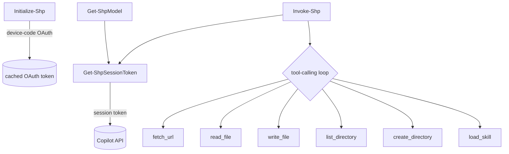

# System patterns

Architecture and recurring implementation patterns for ShellPilot. Update this
file when a new pattern is adopted or an old one is retired.

## Current architecture

A Sampler-built script module. Source lives under source/ (one function per
file) and is compiled by ModuleBuilder into a single versioned module under
output/ at build time.

```text
source/
  Public/    Initialize-Shp, Get-ShpModel, Get-ShpModelName, Invoke-Shp
  Private/   9 helper functions (session token, tool back-ends, loaders)
  Prefix.ps1 module-scope $script: defaults + price-table load
  Suffix.ps1 Register-ArgumentCompleter for Invoke-Shp -Model
  PriceTable.psd1 (copied into the built module via CopyPaths)
  ShellPilot.psd1 / ShellPilot.psm1 (empty; ModuleBuilder fills it)
```

ModuleBuilder concatenates Prefix + Private + Public + Suffix into the built
.psm1; the runtime call graph is unchanged:



## Public surface

- Initialize-Shp - device-code OAuth, caches the token.
- Get-ShpModel - lists models per endpoint.
- Get-ShpModelName - cached model ids for tab-completion.
- Invoke-Shp - one prompt, optional tool-calling loop, rich object result.

## Private helpers

Get-ShpSessionToken, Invoke-CopilotTurn, the tool back-ends
(Invoke-FetchUrlTool, Invoke-ReadFileTool, Invoke-ListDirectoryTool,
Invoke-WriteFileTool, New-DirectoryTool), and the customisation loaders
(Get-ShpInstructionContent, Get-ShpSkillCatalog).

## Recurring patterns

### Dual API abstraction

Invoke-CopilotTurn hides the difference between the chat/completions and
responses API shapes behind one normalised result object (content, tool
calls, usage, reasoning, raw). Invoke-Shp starts on chat and falls back to
responses (or the reverse for reasoning) based on error signatures.

### Tool-calling loop

Each tool is declared as a JSON schema, dispatched by name in a switch, and
its result handed back to the model. A MaxToolIterations guard plus a
consecutive-empty-tool-call circuit breaker prevent runaway loops.

### Progressive disclosure for skills

Get-ShpSkillCatalog injects only skill names and descriptions; the model
pulls a full SKILL.md body on demand through the load_skill tool - mirroring
how VS Code selects skills.

### Front-matter stripping

Get-ShpInstructionContent removes the leading YAML front-matter block so the
same instruction, agent, and skill files used by VS Code can feed the system
prompt.

### Cost from a data file

PriceTable.psd1 maps a model id to per-token rates; cost and credit figures
are computed from reported usage, with the price key resolved
case-insensitively.

### Build pipeline (Sampler)

build.ps1 bootstraps dependencies into output/RequiredModules, then InvokeBuild
runs the workflow from build.yaml: Clean, Build_Module_ModuleBuilder,
Create_changelog_release_output, then Pester. GitVersion derives the module
version from commits and branch (ai/* branches produce a -ai prerelease tag).

## Patterns adopted

- One-function-per-file source layout under source/ (done).
- Sampler build with ModuleBuilder, Pester 5, GitVersion (done).

## Patterns to introduce (pending)

- Raise code coverage above the 25% baseline by testing Invoke-Shp and
  Initialize-Shp (the large, network-bound public functions), then lift the
  CodeCoverageThreshold in build.yaml.
- Structured error records instead of throwing strings.
- Optional secret-store backing for the token (encrypted storage decision).
